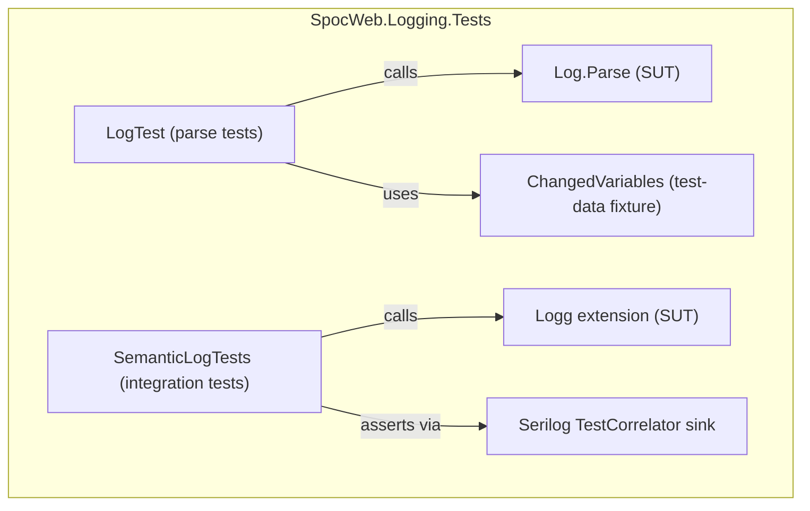

---
digest:
  local-classes:
    ChangedVariables:
      mtime: "2026-06-09T16:27:52Z"
      digest: "77d93cf72221d129132dc1a0eb8fd8c3f8c8cd462302625a599ce8d7ae60fdb2"
    LogTest:
      mtime: "2026-07-07T05:37:18Z"
      digest: "94888f5380c5428a3a4d5addb7594ff85b12a72aa94825922d7085d970429207"
    Program:
      mtime: "2026-06-11T06:17:17Z"
      digest: "517e8a72513e72240f648456893a56215d3fe4197ff08d36aabc26593c964856"
    SemanticLogTests:
      mtime: "2026-06-17T03:32:21Z"
      digest: "7185aea50ffaf2f162f5f170ec028363a28737ee6439205771bca8e412cf66ca"
  folders: {}
---
# SpocWeb.Logging.Tests

NUnit tests for the `Logg` structured-logging facade,
verifying positional/named log parsing and Serilog
semantic-log event emission.

## Dependencies

### Project References

- [SpocWeb.root.logging](../SpocWeb.root.logging/ReadMe.md)

### NuGet Packages

- `coverlet.collector`
- `Microsoft.Extensions.Logging`
- `Microsoft.NET.Test.Sdk`
- `NUnit`
- `NUnit3TestAdapter`
- `Serilog`
- `Serilog.Extensions.Logging`
- `Serilog.Sinks.TestCorrelator`
- `Shouldly`

## Architecture

## Test Classes

| Class | What it tests |
|---|---|
| `LogTest` | Verifies that `Log.Parse` correctly extracts positional (string-interpolation) and named structured-log tokens. |
| `SemanticLogTests` | Integration tests using the Serilog `TestCorrelator` sink to assert that structured events carry correct property names, levels, exceptions, and context prefixes. |
| `ChangedVariables` | Test-data record carrying named fields used as structured-log values in `LogTest`. |

## Classes

| Class | Responsibility |
|---|---|
| [ChangedVariables](ChangedVariables.cs) | Data container holding field and value names used as structured-log test fixtures. |
| [LogTest](LogTest.cs) | NUnit tests verifying that Parse correctly handles  both positional (string-interpolation) and named structured-log patterns. |
| [Program](Program.cs) | Application entry point for the SpocWeb. |
| [SemanticLogTests](SemanticLogTests.cs) | Semantic log tests. |
