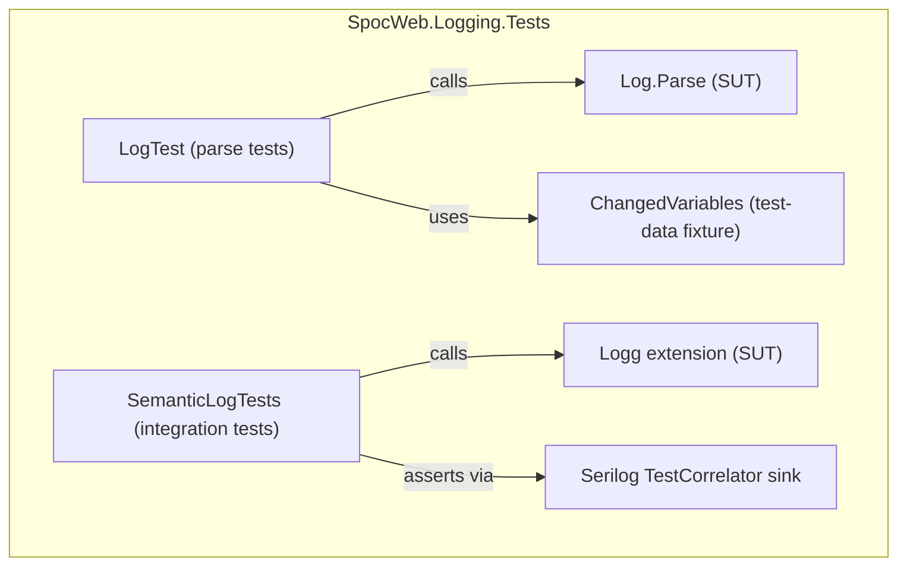

# SpocWeb.Logging.Tests

NUnit tests for the `Logg` structured-logging facade,
verifying positional/named log parsing and Serilog
semantic-log event emission.

## Dependencies

### Project References

- [SpocWeb.root.logging](../SpocWeb.root.logging/ReadMe.md)

### NuGet Packages

- `coverlet.collector`
- `Microsoft.Extensions.Logging`
- `Microsoft.NET.Test.Sdk`
- `NUnit`
- `NUnit3TestAdapter`
- `Serilog`
- `Serilog.Extensions.Logging`
- `Serilog.Sinks.TestCorrelator`
- `Shouldly`

## Architecture

```mermaid
flowchart TD
  subgraph SpocWeb.Logging.Tests
    LogTest["LogTest (parse tests)"]
    SemanticLogTests["SemanticLogTests (integration tests)"]
    ChangedVariables["ChangedVariables (test-data fixture)"]
    Logg["Logg extension (SUT)"]
    LogParse["Log.Parse (SUT)"]
    Serilog["Serilog TestCorrelator sink"]

    LogTest -->|"calls"| LogParse
    linkStyle 0 opacity:1

    LogTest -->|"uses"| ChangedVariables
    linkStyle 1 opacity:1

    SemanticLogTests -->|"calls"| Logg
    linkStyle 2 opacity:1

    SemanticLogTests -->|"asserts via"| Serilog
    linkStyle 3 opacity:1
  end
```

## Test Classes

| Class | What it tests |
|---|---|
| `LogTest` | Verifies that `Log.Parse` correctly extracts positional (string-interpolation) and named structured-log tokens. |
| `SemanticLogTests` | Integration tests using the Serilog `TestCorrelator` sink to assert that structured events carry correct property names, levels, exceptions, and context prefixes. |
| `ChangedVariables` | Test-data record carrying named fields used as structured-log values in `LogTest`. |

## Classes

| Class | Responsibility |
|---|---|
| [ChangedVariables](ChangedVariables.cs) | Data container holding field and value names used as structured-log test fixtures. |
| [LogTest](LogTest.cs) | NUnit tests verifying that Parse correctly handles  both positional (string-interpolation) and named structured-log patterns. |
| [Program](Program.cs) | Application entry point for the SpocWeb.Logging.Tests project. |
| [SemanticLogTests](SemanticLogTests.cs) | Semantic log tests. |
